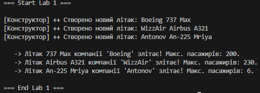

## Лабораторна робота №1

## Виконав - Місюра Владислав

### Тема - Створення першого проєкту. Класи, об’єкти, конструктори та деструктори. Середовище розробки

### Мета - Ознайомитися з середовищем розробки, навчитися створювати класи та працювати з базовими елементами ООП у C#. Налаштувати середовище розробки

### Результати виконання роботи

## Відповіді на контрольні питання
1. Що таке клас та об’єкт?

Клас — це шаблон або креслення. Він описує, які характеристики та поведінку матиме майбутній об'єкт (наприклад, загальне поняття "Літак").
Об’єкт — це конкретний екземпляр, створений за цим шаблоном (наприклад, конкретний "Boeing 737", який ми створили в коді через new).

2. Для чого використовуються конструктори та деструктори?

Конструктор запускається автоматично при створенні об'єкта. Він потрібен, щоб одразу задати початкові дані (наприклад, дати літаку назву та місткість).
Деструктор спрацьовує, коли об'єкт знищується (видаляється з пам'яті). Він потрібен для фінального очищення ресурсів.

3. Чим відрізняється приватне поле від публічної властивості?

Приватне поле (private) — це внутрішні дані класу, до яких ніхто ззовні не має доступу. Це "секрет" об'єкта.
Публічна властивість (public) — це "відкриті двері" або посередник, через якого зовнішній код може безпечно читати або змінювати дані об'єкта.

### Висновок - На цій лабораторній роботі я налаштував робоче середовище (VS Code + Git). Я написав програму на C#, де створив клас Plane (Літак), використав конструктор для створення об'єктів та методи для їх роботи. Насамкінець я навчився зберігати свій код у репозиторії GitHub, щоб відстежувати зміни.