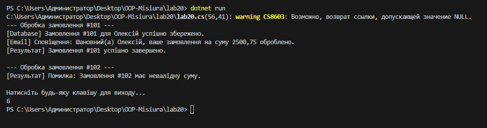

# Лабораторна робота №20: SRP та декомпозиція OrderProcessor

## Тема
Застосування принципу єдиної відповідальності (Single Responsibility Principle) для рефакторингу монолітного коду.

## Мета
Розбити складний клас `OrderProcessor`, який виконує забагато функцій (валідація, логування, збереження в БД, відправка пошти), на окремі, незалежні компоненти.

---

## Опис структури проєкту

Відповідно до принципу **SRP**, кожна відповідальність була винесена в окремий інтерфейс та клас:

1. **`Order`** — модель даних (суміжна з `OrderStatus`).
2. **`IOrderValidator`** — відповідає виключно за бізнес-правила перевірки замовлення.
3. **`IOrderRepository`** — відповідає за збереження даних (абстракція бази даних).
4. **`IEmailService`** — відповідає за зовнішні комунікації (сповіщення).
5. **`OrderService`** — клас-координатор, який використовує впровадження залежностей (**Dependency Injection**) для виконання процесу.

---

## Що було змінено (Рефакторинг)

| Було (Bad Practice) | Стало (Best Practice) |
| Один метод `ProcessOrder` на 50+ рядків | Кожна дія делегована окремому сервісу |
| Жорстка прив'язка до `Console.WriteLine` та логіки БД | Використання інтерфейсів (можна легко змінити БД на SQL або NoSQL) |
| Неможливо протестувати валідацію без запуску всього процесу | Кожен компонент тестується незалежно |

**Скріншот результату:**
