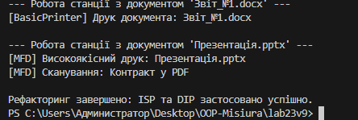

# Звіт з лабораторної роботи №23
**Тема:** ISP & DIP: рефакторинг і DI через конструктор
**Мета:** Застосувати принципи розділення інтерфейсу (ISP) та інверсії залежностей (DIP) для рефакторигу існуючого коду, а також реалізувати Dependency Injection (DI) через конструктор для зменшення зв’язаності та покращення тестування.

---

## 1. Аналіз коду до рефакторингу

У початковій структурі проєкту було виявлено наступні порушення принципів SOLID:

### Порушення ISP (Interface Segregation Principle)
Використовувався один загальний ("товстий") інтерфейс `IMachine`, який містив методи `Print()`, `Scan()` та `Fax()`.
* **Проблема:** Клас `BasicPrinter`, який технічно вміє лише друкувати, був змушений реалізовувати методи `Scan()` та `Fax()`, викидаючи `NotImplementedException`.
* **Наслідок:** Клієнти залежали від методів, які вони не використовують, що робило код жорстким та надлишковим.

### Порушення DIP (Dependency Inversion Principle)
Клас вищого рівня `OfficeWorkstation` створював об'єкт конкретного класу `BasicPrinter` безпосередньо у своєму конструкторі через ключове слово `new`.
* **Проблема:** Модуль високого рівня залежав від конкретної реалізації низького рівня, а не від абстракції.
* **Наслідок:** Висока зв'язність (Tight Coupling). Будь-яка заміна моделі принтера потребувала втручання в код основного класу.

---

## 2. Опис виконаного рефакторингу

Для виправлення архітектурних недоліків було вжито наступні кроки:

1.  **Розділення інтерфейсів (ISP):** Інтерфейс `IMachine` було розбито на вузькоспеціалізовані інтерфейси `IPrinter` та `IScanner`. Тепер класи реалізують лише той функціонал, який їм притаманний.
2.  **Інверсія залежностей (DIP):** Клас `OfficeWorkstation` тепер залежить виключно від інтерфейсу `IPrinter`. Він не знає, яка саме модель принтера використовується.
3.  **Впровадження залежностей (DI):** Об'єкт принтера передається (впорскується) у клас `OfficeWorkstation` через конструктор. Це дозволяє легко замінювати реалізації під час запуску програми в `Program.cs`.

---

## 3. Демонстрація структури коду

```csharp
// Абстракції (ISP)
public interface IPrinter { void Print(string doc); }
public interface IScanner { void Scan(string doc); }

// Модуль високого рівня з DI (DIP)
public class OfficeWorkstation {
    private readonly IPrinter _printer;

    public OfficeWorkstation(IPrinter printer) { // Dependency Injection
        _printer = printer;
    }

    public void Run(string doc) {
        _printer.Print(doc);
    }
}


