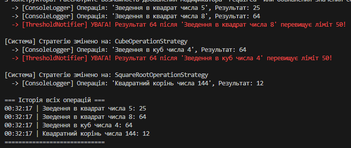

# Звіт з лабораторної роботи №24
**Тема:** Strategy + Observer: динамічна підстановка алгоритмів + тести
**Мета:** Застосувати патерни Strategy та Observer для створення гнучкої системи, яка дозволяє динамічно змінювати алгоритми обробки даних та автоматично сповіщати залежні компоненти про зміни.

---

## 1. Архітектура та реалізовані патерни

У цій лабораторній роботі було розроблено систему обробки числових даних. Для забезпечення гнучкості, розширюваності та дотримання принципів SOLID (зокрема OCP та DIP) було використано комбінацію двох поведінкових патернів: **Strategy** та **Observer**.

### Патерн Strategy (Стратегія)
Патерн застосовано для інкапсуляції математичних алгоритмів та можливості їх динамічної зміни під час виконання програми (runtime).

* **Інтерфейс `INumericOperationStrategy`**: визначає загальний контракт `Execute(double value)` для всіх математичних операцій.
* **Конкретні стратегії**: `SquareOperationStrategy` (квадрат), `CubeOperationStrategy` (куб), `SquareRootOperationStrategy` (квадратний корінь). Кожна з них реалізує свій алгоритм.
* **Контекст `NumericProcessor`**: клас, який отримує стратегію через конструктор і може змінювати її за допомогою методу `SetStrategy`. Він не містить власної логіки обчислень, а делегує її поточній стратегії.

### Патерн Observer (Спостерігач)
Патерн реалізовано за допомогою вбудованого механізму подій (events) та делегатів (`Action`) у мові C#. Це дозволило створити реактивну систему сповіщень зі слабкою зв'язністю.

* **Видавець (Subject) - `ResultPublisher`**: містить подію `ResultCalculated`. Метод `PublishResult` генерує (invoke) цю подію, передаючи результат обчислення та назву операції.
* **Спостерігачі (Observers)**: 
  1. `ConsoleLoggerObserver` — просто виводить результат у консоль.
  2. `HistoryLoggerObserver` — зберігає всі результати у внутрішній список (`List<string>`) для подальшого аналізу.
  3. `ThresholdNotifierObserver` — реагує (виводить попередження червоним кольором) лише тоді, коли результат перевищує заданий ліміт (наприклад, 50).

---

## 2. Переваги реалізованої структури

1. **Гнучкість (Open/Closed Principle)**: Ми можемо додати нові математичні операції (наприклад, обчислення синуса чи логарифма), просто створивши новий клас стратегії. Жоден існуючий клас змінювати не доведеться.
2. **Динамічність**: `NumericProcessor` може змінювати свою поведінку "на льоту" залежно від вимог користувача.
3. **Слабка зв'язність (Loose Coupling)**: `ResultPublisher` нічого не знає про класи `ConsoleLoggerObserver` чи `HistoryLoggerObserver`. Він просто викликає подію, а всі підписані компоненти реагують на неї самостійно.
4. **Тестованість**: Завдяки впровадженню залежностей через інтерфейс `INumericOperationStrategy`, клас `NumericProcessor` дуже легко покрити модульними тестами (Unit Tests), передаючи йому Mock-стратегії. Так само легко тестувати події.

---

## 3. Висновок

Під час виконання лабораторної роботи було практично доведено ефективність спільного використання патернів **Strategy** та **Observer**. 
* **Strategy** взяв на себе відповідальність за варіативність алгоритмів, ізолювавши складну бізнес-логіку.
* **Observer** забезпечив асинхронну (подієву) взаємодію між компонентами системи, дозволивши різним частинам програми (логіювання, моніторинг порогів) незалежно реагувати на результати обчислень.

Така архітектура є стандартом для розробки складних, масштабованих та легко тестованих корпоративних додатків.

