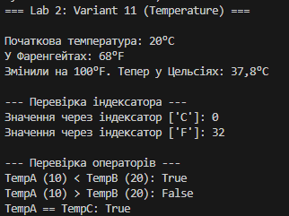

## Лабораторна робота №2

## Виконав - Місюра Владислав

### Тема - Інкапсуляція. Властивості, індексатори та перевантаження операторів.

### Мета - Навчитися застосовувати інкапсуляцію у класах, створювати властивості для доступу до приватних полів, реазовувати індексатори та перезавантажувати оператори у С#.

### 

1. Що таке інкапсуляція? Це принцип ООП, який дозволяє приховати внутрішню реалізацію об'єкта і захистити його дані від прямого втручання ззовні. Це досягається об'єднанням даних і методів в одному класі та використанням модифікаторів доступу (наприклад, private для полів).

2. Для чого потрібні властивості замість публічних полів? Властивості (get/set) дозволяють контролювати доступ до даних:

Додавати логіку перевірки (валідацію) перед записом значення.

Створювати поля "тільки для читання" (без set).

Обчислювати значення "на льоту", не зберігаючи їх у пам'яті (як Fahrenheit у вашому коді).

3. Як реалізувати індексатор у класі? Індексатор дозволяє працювати з об'єктом як з масивом. Він реалізується за допомогою ключового слова this. Синтаксис:

C#

public тип_повернення this[тип_індексу індекс]
{
    get { /* логіка */ }
    set { /* логіка */ }
}
4. Як перевантажуються оператори в C#? Оператори перевантажуються за допомогою статичних методів із ключовим словом operator. Приклад: public static bool operator > (Temperature t1, Temperature t2) { ... } Важливо: Деякі оператори (наприклад, == та !=, > та <) повинні перевантажуватися парами.

## Висновок:
 На цій лабораторній роботі я закріпив навички об'єктно-орієнтованого програмування на мові C#. В ході виконання завдання (Варіант 11 — клас Temperature) я: Реалізував інкапсуляцію за допомогою приватних полів та публічних властивостей, що дозволило захистити дані та автоматично обчислювати температуру за Фаренгейтом. Створив індексатор, який забезпечує зручний доступ до значень температури через рядкові ключі ("C", "F").
 Перевантажив оператори порівняння (>, <, ==, !=), що дозволяє інтуїтивно порівнювати об'єкти класу між собою.