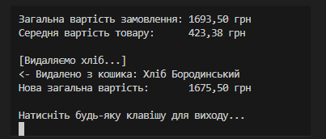

## Лабораторна робота №4

## Виконав - Місюра Владислав

### Тема - Абстракції та інтерфейси. Композиція та агрегація

### Мета: Hавчитися створювати абстрактні класи та інтерфейси, будувати ієрархії класів із використанням композиції та агрегації, реалізовувати прості обчислення, демонструвати гнучкість і повторне використання коду.

### Результат виконання роботи

### 

### Ось максимально чіткі та короткі відповіді для захисту:

### 1. Різниця між абстрактним класом та інтерфейсом:

Абстрактний клас — це заготовка ("Is-a"). Може мати код, змінні та конструктори. Спадкується тільки один раз.
Інтерфейс — це набір правил ("Can-do"). Не має коду і змінних (тільки методи). Клас може реалізувати багато інтерфейсів.

### 2. Композиція чи Наслідування:

Наслідування — коли об'єкт є різновидом іншого (Кіт → Тварина).
Композиція — коли об'єкт складається з частин (Авто → Двигун).
Краще композиція, бо вона дає більшу гнучкість.

### 3. Агрегація vs Композиція:

Композиція: Частина вмирає разом із цілим (Кімната зникне, якщо знести Дім).
Агрегація: Частина живе окремо від цілого (Товар залишиться на складі, якщо видалити Кошик).

### 4. Чи може клас мати кілька інтерфейсів:

Так. Це головна перевага інтерфейсів (множинне спадкування реалізації).

### 5. Навіщо інтерфейс як контракт:

Щоб гарантувати, що об'єкт точно має необхідні методи. Це дозволяє коду працювати з будь-якими класами однаково (поліморфізм)

## Висновок: 
На цій лабораторній роботі я засвоїв принципи побудови ієрархії класів та різницю між композицією і агрегацією. Я створив програму, де використав інтерфейс як контракт для різних типів товарів, що забезпечило гнучкість коду та можливість його легкого розширення.