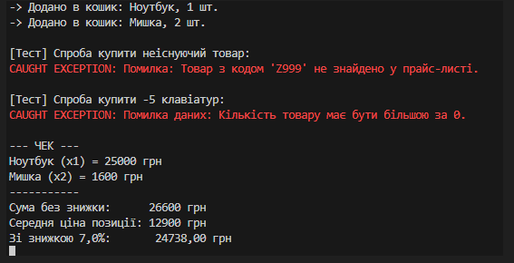

## Лабораторна робота №5

## Виконав - Місюра Владислав

### Тема - Узагальнені типи (Generics), колекції і LINQ, обробка винятків.

### Мета: Навчитися створювати узагальнені класи/методи, працювати з колекціями та LINQ, коректно валідувати вхідні дані і створювати/обробляти винятки.

### Результат виконання роботи

### 

### Відповіді на контрольні запитання

1. Що таке Generics (Узагальнення)? 
Це параметризовані типи (наприклад, <T>). Переваги:
Швидкість: Працюють без зайвих перетворень (без boxing/unboxing).
Безпека: Компілятор не дасть покласти string у список int.
Універсальність: Один код працює для різних типів даних.

2. ArrayList vs List<T>
ArrayList: Застарів. Зберігає все як object (повільно, небезпечно).
List<T>: Сучасний стандарт. Зберігає конкретний тип (швидко, надійно).

3. Dictionary<TKey, TValue> vs List<T>
List (Список): Доступ за порядковим номером (індексом). Пошук значення повільний (треба перебирати все).
Dictionary (Словник): Доступ за унікальним ключем. Пошук миттєвий (як у телефонній книзі).

4. Перевага LINQ над циклами
Лаконічність: 1 рядок коду замість 10.
Читабельність: Пишеш "ЩО треба знайти" (фільтр, сортування), а не "ЯК перебирати масив".

5. Як працює finally? Це блок коду, який виконується завжди (навіть якщо виникла помилка або був return). Навіщо: Щоб гарантовано закрити файли, базу даних або з'єднання.

6. Коли створювати власні винятки? Коли стандартних помилок (типу IndexOutOfRangeException) недостатньо, щоб описати проблему бізнес-логіки (наприклад, NotEnoughMoneyException або ProductNotFoundException).

### Висновок - на цій лабораторній роботі я поглибив знання з об'єктно-орієнтованого програмування в C#. Я навчився використовувати узагальнення (Generics) для створення універсальних компонентів, реалізував механізм обробки винятків для підвищення надійності програми, а також закріпив на практиці використання агрегації для побудови зв'язків між об'єктами.