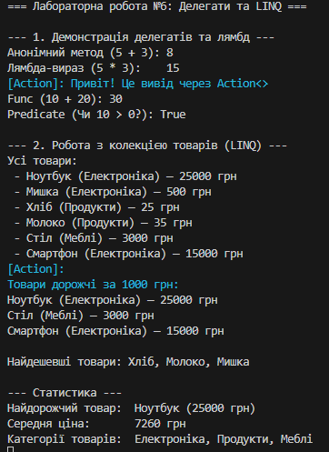

## Лабораторна робота №6

## Виконав - Місюра Владислав

### Мета роботи
Закріпити знання про делегати та події.
Навчитись використовувати анонімні методи, лямбда-вирази і вбудовані делегати (Func<>, Action<>, Predicate<>).
Отримати практичний досвід застосування лямбда-виразів у колекціях і LINQ-операціях.

### Результат виконання роботи

### 