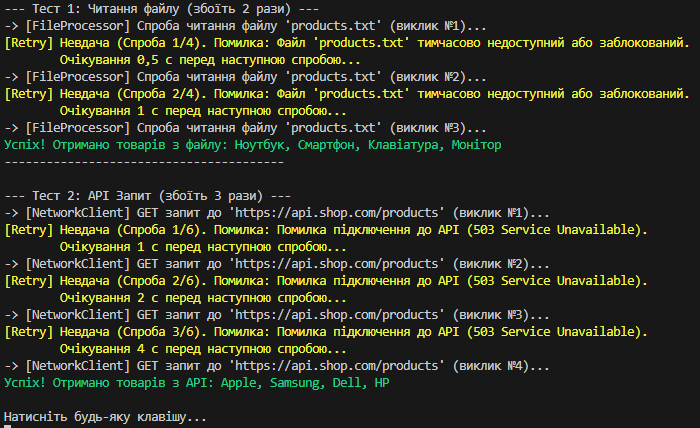

## Лабораторна робота №7

## Виконав - Місюра Владислав

### Тема - Обробка IO/мережевих помилок та патерн Retry.

### Мета - Навчитися обробляти типові помилки вводу/виводу та мережеві помилки за допомогою блоків try-catch-finally, а також реалізувати патерн Retry для підвищення відмовостійкості застосунків.
### Результат виконання роботи

### 

### Відповіді на контрольні запитання - .

Які винятки найчастіші?
Файли: FileNotFoundException (немає файлу), IOException (файл зайнятий іншим процесом), UnauthorizedAccessException (немає прав).
Мережа: HttpRequestException (сервер повернув помилку), TimeoutException (сервер довго не відповідає).

2. Принцип Retry та коли використовувати?
Принцип: Якщо сталась помилка, програма чекає паузу і пробує знову (цикл спроб), замість того, щоб впасти.
Коли: Тільки для тимчасових збоїв (зник інтернет на секунду, сервер перевантажений). Не можна для постійних помилок (невірний шлях).

3. Як реалізувати експоненційну затримку?
Треба множити час очікування на 2 з кожною новою спробою (1с → 2с → 4с → 8с).
У коді: Thread.Sleep(baseDelay * Math.Pow(2, attempt));

4. Навіщо shouldRetry?
Це фільтр. Він потрібен, щоб розрізняти помилки:
Мережа впала → пробуємо ще (return true).
Файлу не існує → немає сенсу пробувати (return false), одразу кидаємо помилку.

### На цій лабораторній роботі я опанував методи обробки критичних помилок (IOException, HttpRequestException). Я реалізував механізм повторних спроб (Retry Pattern), який дозволяє програмі не падати при тимчасових збоях, а відновлювати роботу самостійно.